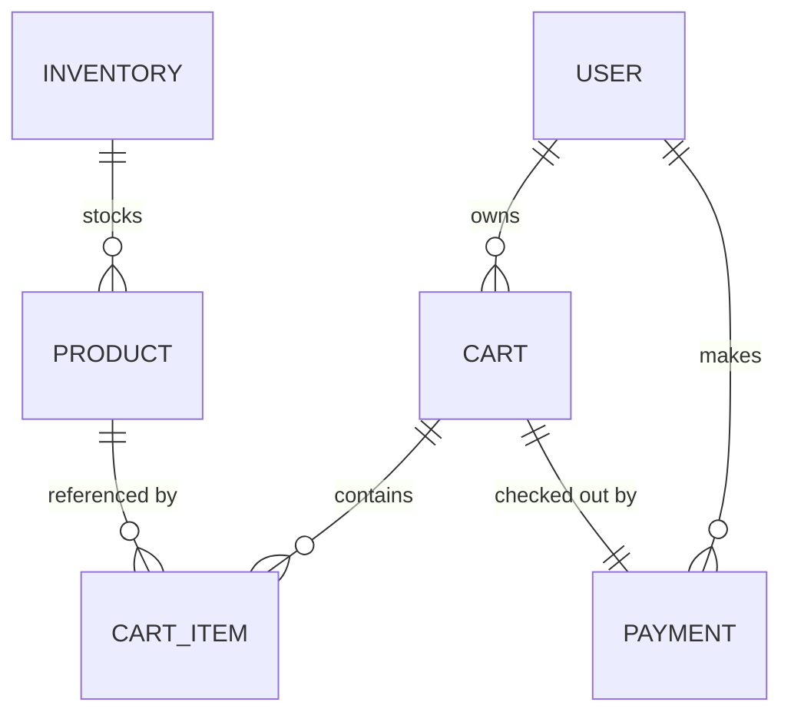
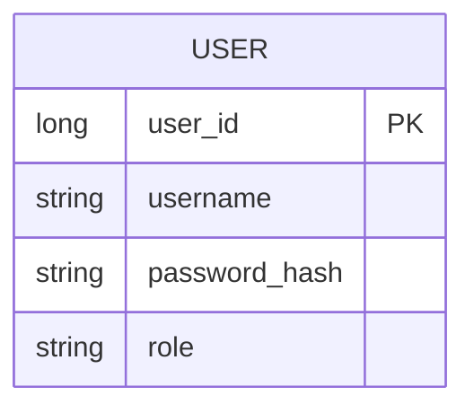
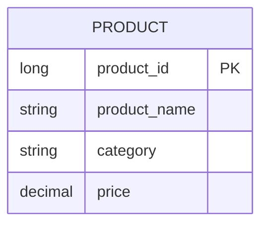
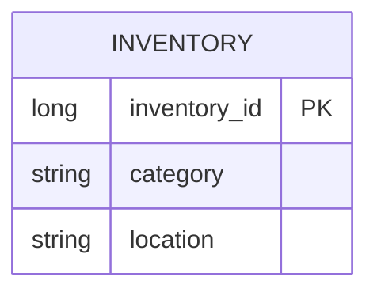
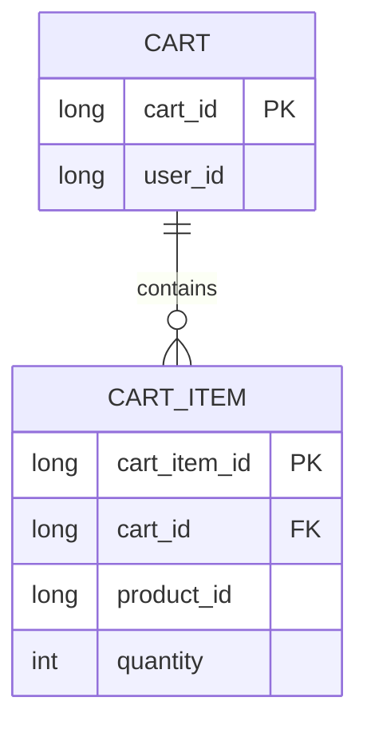
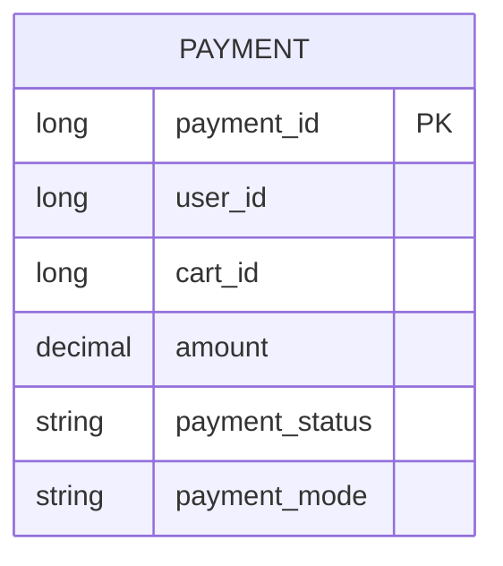

# 📦 Inventory Management System

The Inventory Management System is a distributed microservices-based application developed using Spring Boot and Spring Cloud. It is designed to simulate a real-world inventory/e-commerce platform, enabling seamless management of users, products, inventory, carts, and payments with high scalability and modularity.

This system follows modern enterprise architecture patterns, ensuring each microservice is independently deployable, has its own database, and communicates with others securely via API Gateway and Eureka Service Discovery.
---

## 🌟 Features

- ✅ **Service Discovery** with **Eureka Server**
- ✅ **API Gateway** as a single entry point with routing & JWT validation
- ✅ **User Authentication & Authorization** with Spring Security + JWT
- ✅ **Product Catalog Management** (CRUD for products)
- ✅ **Inventory Management** (stock validation, search by location)
- ✅ **Shopping Cart** (add/remove/update cart items)
- ✅ **Payment Processing** integrated with Cart Service
- ✅ Independent **databases per service** (MySQL/H2)
- ✅ **Centralized Exception Handling**

---

## 🏗️ Architecture


```mermaid
flowchart TB
  C[Client / Frontend]
  AG[API Gateway\n(8080)\nJWT validation]
  EU[Eureka Server\n(8761)]

  subgraph S[Microservices]
    US[User Service\nAuth/JWT]
    PS[Product Service]
    IS[Inventory Service]
    CS[Cart Service]
    PAY[Payment Service]
  end

  subgraph DBs[Per-service Databases]
    UDB[(User DB)]
    PDB[(Product DB)]
    IDB[(Inventory DB)]
    CDB[(Cart DB)]
    PAYDB[(Payment DB)]
  end

  C --> AG
  AG -. register/discover .-> EU
  AG --> US
  AG --> PS
  AG --> IS
  AG --> CS
  AG --> PAY

  CS -. get product info .-> PS
  IS -. validate product .-> PS
  PAY -. read total & userId .-> CS

  C -. login .-> AG
  AG --> US
  US -. issue JWT .-> C

  US --> UDB
  PS --> PDB
  IS --> IDB
  CS --> CDB
  PAY --> PAYDB
```

---

## 📂 Services Breakdown

### 1️⃣ Eureka Server

- **Port:** 8761
- **Purpose:** Service registry
- **Dashboard:** [http://localhost:8761](http://localhost:8761)

### 2️⃣ API Gateway

- **Port:** 8080
- **Routes:**
  - `/user-service/** → USER-SERVICE`
  - `/product-service/** → PRODUCT-SERVICE`
  - `/inventory-service/** → INVENTORY-SERVICE`
  - `/cart-service/** → CART-SERVICE`
  - `/payment-service/** → PAYMENT-SERVICE`
- **Responsibilities:** Routing, JWT validation

### 3️⃣ User Service

- **Port:** 8085
- **Features:**
  - `POST /auth/login` → Login & issue JWT
  - `POST /auth/register` → Register user
  - `GET /users` → Manage users
- **Security:** Spring Security + JWT

### 4️⃣ Product Service

- **Port:** 8084
- **Features:**
  - `POST /products` → Create product
  - `GET /products` → List all
  - `GET /products/{id}` → By ID
  - `PUT /products/{id}` → Update
  - `DELETE /products/{id}` → Delete
  - `GET /products/inventory/{invtId}` → By inventory

### 5️⃣ Inventory Service

- **Port:** 8083
- **Features:**
  - `POST /inventory` → Add record
  - `GET /inventory` → All inventories
  - `GET /inventory/{id}` → By ID
  - `PUT /inventory/{id}` → Update
  - `DELETE /inventory/{id}` → Delete
  - `GET /inventory/inventoriesByLocation/{loc}` → Filter by location

### 6️⃣ Cart Service

- **Port:** 8082
- **Features:**
  - `POST /cart` → Create new cart
  - `GET /cart/{id}` → Get cart by ID
  - `DELETE /cart/{id}` → Delete cart
  - `POST /cart/{id}/items` → Add item
  - `GET /cart/{id}/items` → List items
  - `PUT /cart/{id}/items/{itemId}` → Update item
  - `DELETE /cart/{id}/items/{itemId}` → Remove item
- **Integration:** Calls Product Service for product details

### 7️⃣ Payment Service

- **Port:** 8085
- **Features:**
  - `POST /payments/checkout` → Process payment for a cart
- **Flow:**
  1. Fetches cart via Cart Service
  2. Validates user & total amount
  3. Saves payment record

---

## 🔑 Security Workflow

1. User logs in via **User Service** → JWT issued
2. Client includes JWT in request headers
3. **API Gateway** validates JWT
4. Request forwarded to relevant service
5. Services trust JWT-validated traffic only via Gateway

---

## 🗄️ ER Diagrams

### System-level ER Diagram



### Per-service ERDs

**User Service DB**



**Product Service DB**



**Inventory Service DB**



**Cart Service DB**



**Payment Service DB**



---

## 🚀 Getting Started

### Prerequisites

- Java 17+
- Maven 3.8+
- MySQL running locally

### Build & Run

```bash
# Build all services
mvn clean install

# Run each microservice
mvn spring-boot:run
```

### Ports

- Eureka: **8761**
- Gateway: **8080**
- User: **8085**
- Product: **8084**
- Inventory: **8083**
- Cart: **8082**
- Payment: **8085**

---

## &#x20;Highlights

- Showcases **real-world inventory management system**
- Implements **microservices best practices**
- Demonstrates **Spring Security & JWT**
- Uses **Eureka + Gateway** for scalability
- Clean separation: each service has its **own DB & logic**

---

##

